# Appointment System Frontend

Bu proje, kullanıcıların randevu oluşturmasını, işletmelerin randevuları yönetmesini ve yöneticilerin tüm sistemi kontrol etmesini sağlayan bir **Randevu Yönetim Sistemi**'nin frontend tarafıdır.

Uygulama, müşterilerin işletmeleri keşfetmesini, müsait zaman dilimlerini görüntülemesini ve sorunsuz bir şekilde randevu almasını sağlar. İşletme sahipleri için randevu, hizmet ve zaman yönetimi araçları sunarken, yöneticilere sistem genelinde kapsamlı bir kontrol imkanı tanır. Şık, duyarlı ve sezgisel bir kullanıcı deneyimi sunmak üzere tasarlanmıştır.

---

## 🚀 Kullanılan Teknolojiler

| Teknoloji                                                                                            | Açıklama                                                                                                                                                             |
| ---------------------------------------------------------------------------------------------------- | -------------------------------------------------------------------------------------------------------------------------------------------------------------------- |
| **[Next.js](https://nextjs.org/)**                                                                   | React tabanlı, sunucu tarafı renderlama (SSR), statik site üretimi (SSG) ve API rotaları gibi özelliklerle performans ve SEO'yu artıran güçlü bir React framework'ü. |
| **[Tailwind CSS](https://tailwindcss.com/)**                                                         | Hızlı ve esnek UI geliştirmeyi sağlayan, utility-first bir CSS framework.                                                                                            |
| **[ShadCN UI](https://ui.shadcn.com/)**                                                              | Tailwind CSS ve Radix UI üzerine inşa edilmiş, erişilebilir ve özelleştirilebilir, modern UI bileşenleri kütüphanesi.                                                |
| **[Redux Toolkit](https://redux-toolkit.js.org/)**                                                   | Durum yönetimi için standart bir çözüm sunar. Özellikle RTK Query ile API istekleri, önbellekleme, yükleme ve hata durumları kolayca yönetilir.                      |
| **[Zod](https://zod.dev/)**                                                                          | Form doğrulama ve veri şemalarını tanımlamak için kullanılan TypeScript-first şema bildirim ve doğrulama kütüphanesi.                                                |
| **[Google Maps JS API](https://developers.google.com/maps/documentation/javascript/overview?hl=tr)** | Konum seçimi ve harita tabanlı işlemler için                                                                                                                         |
| **[Lucide React](https://lucide.dev/)**                                                              | Uygulama genelinde kullanılan hafif ve özelleştirilebilir ikonlar kütüphanesi.                                                                                       |
| **[Sonner](https://www.npmjs.com/package/sonner)**                                                   | Kullanıcıya şık ve özelleştirilebilir toast bildirimleri sunmak için kullanılan bir kütüphane.                                                                       |

---

# Kullanıcı Rolleri

- **Customer** – Randevu oluşturur
- **Business** – Randevuları, işletmesini ve takvimini yönetir
- **Admin** – Paketleri ve işletmeleri yönetir

# Dosya Yapısı

Bu proje, Next.js App Router'ın modern dosya tabanlı yönlendirme ve düzenleme yapısını kullanır.

```bash
src/
├── app/                          # Ana uygulama dizini (App Router)
│   ├── page.tsx                    # Ana sayfa
│   ├── layout.tsx                  # Genel uygulama düzeni (Root Layout)
│   ├── globals.css                 # Genel CSS stilleri
│   │
│   ├── (auth)/                     # Kimlik doğrulama ile ilgili rotalar grubu
│   │   ├── login/page.tsx          # Giriş sayfası
│   │   ├── register/page.tsx       # Kayıt sayfası
│   │   ├── confirmEmail/page.tsx   # E-posta doğrulama sayfası
│   │   ├── forgotPassword/page.tsx # Şifre sıfırlama sayfası
│   │   └── layout.tsx              # Kimlik doğrulama rotalarına özel düzen
│   │
│   ├── (routes)/                   # Genel, herkese açık rotalar grubu
│   │   ├── about/page.tsx          # Hakkımızda sayfası
│   │   ├── business/page.tsx       # İşletme listeleme sayfası
│   │   ├── contact/page.tsx        # İletişim sayfası
│   │   ├── packages/page.tsx       # Abonelik paketleri sayfası
│   │   └── layout.tsx              # Genel rotalara özel düzen
│   │
│   ├── [slug]/                     # Dinamik işletme randevu sayfası (örn: /bir-isletme-adi)
│   │   └── page.tsx                # İşletmeye özel randevu alma sayfası
│   │
│   ├── appointment/                # Müşterilerin kendi bölgelerindeki işletmelerini bulmalarını sağlar
│   │       ├── business/
│   │       │   ├── page.tsx
│   │       │
│   │       └── layout.tsx
│   │
│   └── dashboard/                  # Kimlik doğrulaması gerektiren paneller
│       ├── layout.tsx              # Dashboard genel düzeni
│       │
│       ├── admin/                  # Yönetici (Admin) paneli rotaları
│       │   ├── page.tsx            # Admin ana sayfası
│       │   ├── business/page.tsx   # Admin: İşletme yönetimi
│       │   ├── packages/page.tsx   # Admin: Paket yönetimi
│       │   └── layout.tsx          # Admin paneline özel düzen
│       │
│       └── business/               # İşletme Sahibi paneli rotaları
│           ├── home/page.tsx           # İşletme Ana Sayfası
│           ├── appointments/page.tsx   # İşletme: Randevu görüntüleme/yönetimi
│           ├── calendar/page.tsx       # İşletme: Haftalık takvimden randevu görüntüleme
│           ├── createBusiness/page.tsx # İşletme: İşletme oluşturma
│           ├── profile/page.tsx        # İşletme: İşletme bilgilerini görüntüleme/güncelleme
│           ├── services/page.tsx       # İşletme: İşletmenin vereceği hizmetleri yönetme
│           ├── settings/page.tsx       # İşletme: Ayarlar sayfası
│           ├── statistics/page.tsx     # İşletme: İşletmenin istatistikleri
│           ├── subscription/page.tsx   # İşletme: Aboneliği yönet
│           ├── time-slots/page.tsx     # İşletme: İşletmenin zaman aralıklarını yönetme
│           └── layout.tsx              # İşletme paneline özel düzen
│
├── components/                 # Yeniden kullanılabilir UI bileşenleri
│   ├── appointment/            # Randevu akışına özel bileşenler
│   ├── auth/                   # Kimlik doğrulama formları/UI
│   ├── contact/                # İletişim formları/UI
│   ├── dashboard/              # Dashboard genel bileşenleri
│   │   └── business/           # İşletme dashboard'ına özel bileşenler
│   │   └── admin/              # Admin dashboard'ına özel bileşenler
│   ├── footer/                 # Footer
│   ├── header/                 # Mobil & desktop header
│   ├── ui/                     # ShadCN UI bileşenleri
│   └── home/                   # Landing page bileşenleri (Hero, Features, Pricing...)
│
├── lib/                        # Yardımcı fonksiyonlar ve yapılandırmalar
│   ├── slices/                 # Redux dilimleri (slices)
│   ├── auth.ts                 # Kimlik doğrulama yardımcıları
│   ├── ReduxProvider.tsx       # Redux store'u sağlayan bileşen
│   ├── store.ts                # Redux store yapılandırması
│   ├── utils.ts                # Çeşitli yardımcı fonksiyonlar (örn: `cn` için)
│   ├── zodSchemas.ts           # Zod ile tanımlanmış şemalar
│   └── api-requests.ts         # Doğrudan fetch yapan API fonksiyonları (Server Components için)
│
├── models/                     # TypeScript arayüzleri ve veri modelleri
├── services/                   # Redux Toolkit Query API servisleri (RTK Query)
├── hooks/                      # Özel React hook'ları

├── next.config.js              # Next.js yapılandırması
├── middleware.ts               # Role-based yönlendirmeler için middleware
```

## 🖼️ Ekran Görüntüleri

## Ana Sayfa Ekranı

Ziyaretçilere sistemin işleyişi, özellikleri ve avantajları hakkında genel bir tanıtım sunar. Kullanıcıyı yönlendiren birinci temas noktasıdır.İşletmeleri keşfetme, paketleri inceleme ve sisteme giriş yapma seçeneklerini sunar.


## Paketler Ekranı

İşletmelerin ihtiyacına uygun planları seçebileceği detaylı paket listesidir.Fiyat ve kapsam bilgileri net ve anlaşılır şekilde sunulur.
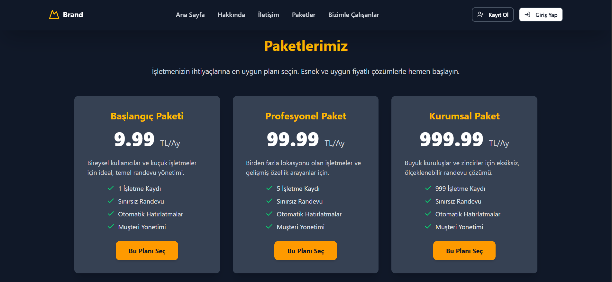

## Kayıt Ekranı

Yeni kullanıcıların (İşletme Sahibi rolünde) sisteme kaydolabileceği form ekranıdır. E-posta, şifre gibi temel bilgiler toplanır.
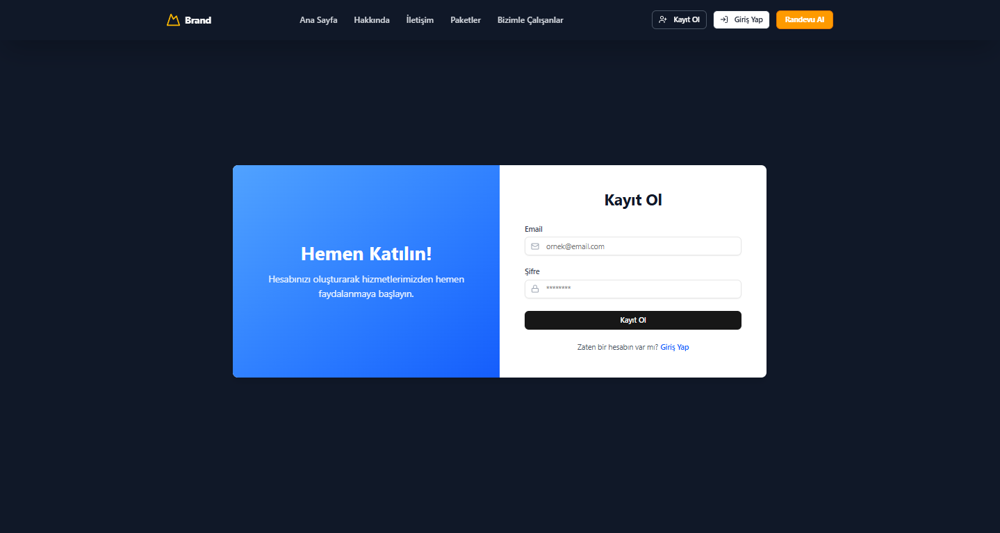

## Giriş Ekranı

Kayıtlı kullanıcıların (Admin veya İşletme Sahibi) e-posta ve şifreleriyle sisteme güvenli giriş yapabileceği ekran. Başarılı giriş sonrası JWT tabanlı kimlik doğrulama ile kullanıcılar rollerine göre ilgili panele yönlendirilir.

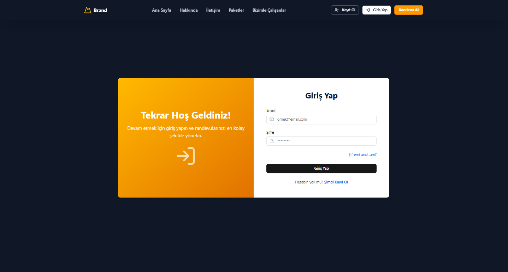

## E-mail Doğrulama

Kayıt işleminden sonra kullanıcının e-posta adresine gönderilen doğrulama kodunu girerek hesabını aktive edebileceği sayfa.
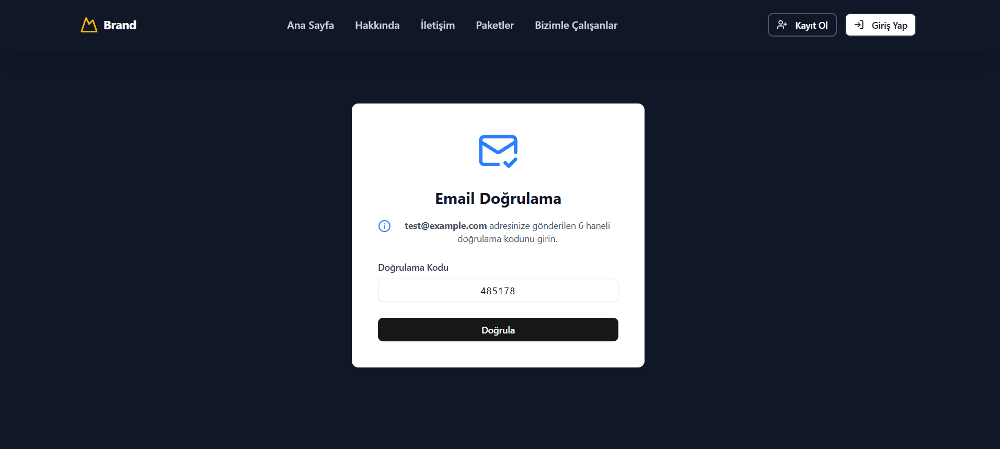

#### Doğrulama E-postası Örneği

Kullanıcının e-posta adresine gönderilen, hesap doğrulama için gerekli olan tek kullanımlık kodu içeren e-posta örneği.
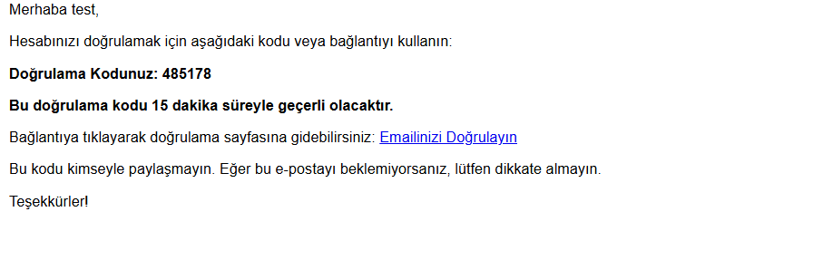

## İşletme Bulma Ekranı

Müşteriler kendi bölgelerindeki işletmeleri kolayca bulabilir ve randevu alabilir.
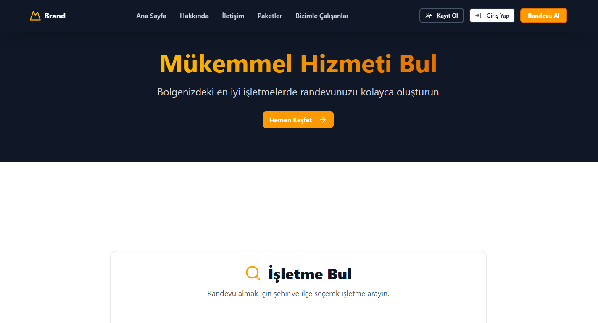
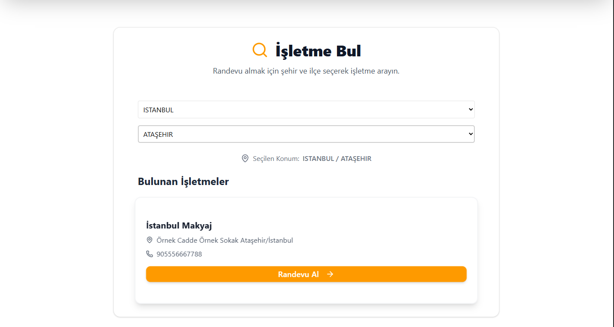

## İşletme Paket Seçme Ekranı

İşletme sahiplerinin kendi işletmelerini oluşturmadan önce, ihtiyaçlarına en uygun abonelik paketini seçebileceği arayüz. İşletme herhangi bir pakete abone olmadan önce kayıt olabilir ama herhangi bir abonelik almadan işletme oluşturamaz.
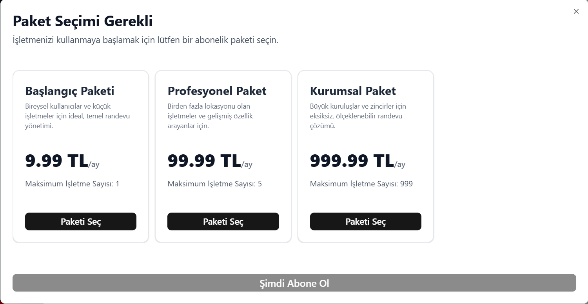

## İşletme Ana Sayfa Ekranı

İşletme sahipleri, bugünkü randevu sayılarını, en yakın zamandaki randevu bilgilerini ve günlük tahmini gelirlerini buradan takip edebilir.


## İşletme Ekleme Ekranı

İşletme sahiplerinin, işletmelerinin temel bilgilerini (adı, adresi, iletişim bilgileri, konumu vb.) sisteme girebileceği form ekranıdır. Google Haritalar entegrasyonu ile konum belirleme kolaylığı sunar.
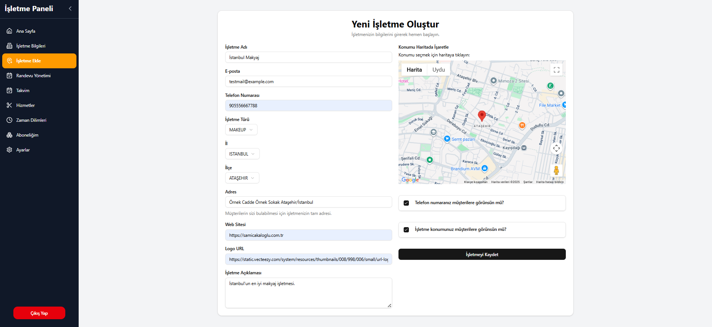

## İşletme Detay Ekranı

İşletme sahibinin kendi işletmesinin genel bilgilerini görüntüleyebileceği ve düzenleyebileceği detay ekranı.
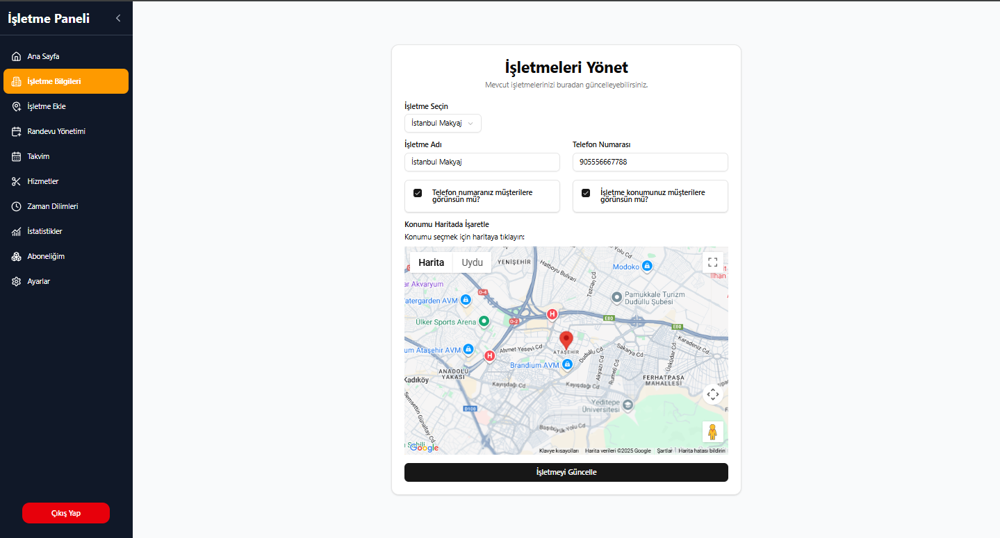

## İşletme Hizmet Yönetimi Ekranı

İşletme sahiplerinin, sundukları hizmetleri (örn: saç kesimi, masaj) ekleyebileceği, düzenleyebileceği ve silebileceği yönetim paneli. Her hizmetin adı, süresi ve fiyatı belirlenebilir.


## İşletme Zaman Aralıkları Yönetimi Ekranı

İşletme sahiplerinin, haftanın belirli günleri için çalışma saatlerini ve randevu alınabilecek zaman aralıklarını (slotları) belirleyebileceği ekran. Bu sayede müşteriler sadece müsait zaman dilimlerini görebilir. İşletme sahiplerine her günü ayrı zaman dilimlerine bölme özgürlüğü sunar.
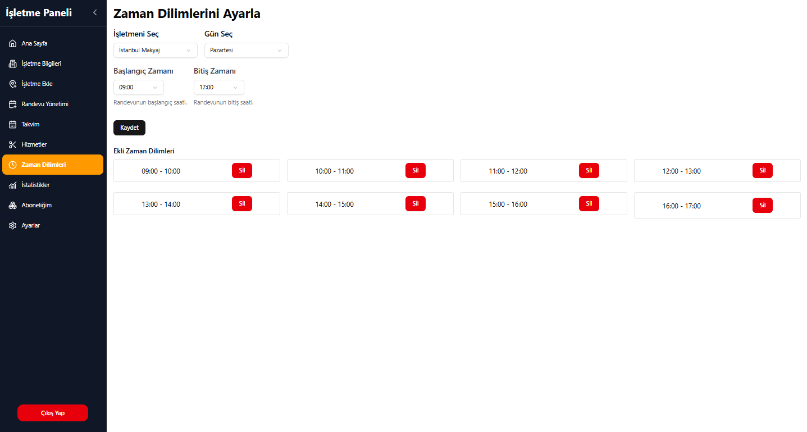

## İşletme Randevu Yönetimi Ekranı

İşletme sahiplerinin kendilerine ait randevuları listeleyebileceği, detaylarını görüntüleyebileceği yönetim paneli. Bu panel üzerinden kendileri de müşteriler için randevu oluşturabilirler.

#### Müsait bir zaman.

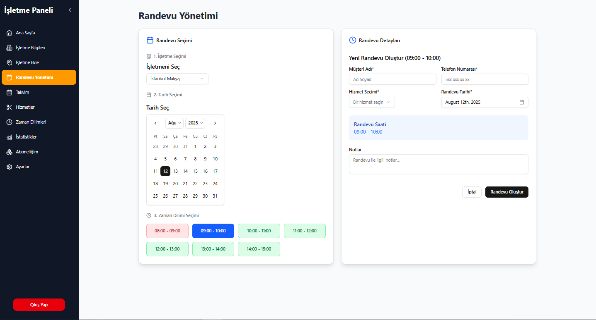

#### Randevu alınmış bir zaman.

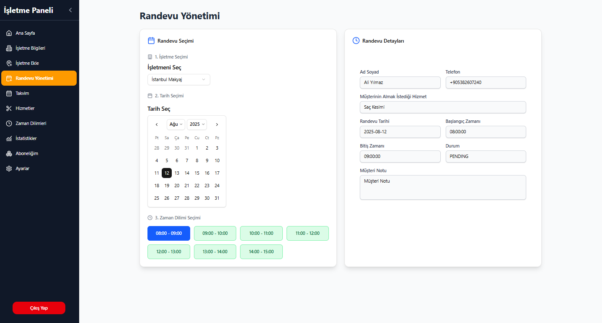

## İşletme Takvim Ekranı

İşletme sahiplerinin randevularını takvim görünümünde kolayca takip edebileceği, günlük veya haftalık bazda müsaitlik durumlarını ve dolu slotları görsel olarak görebileceği arayüz.
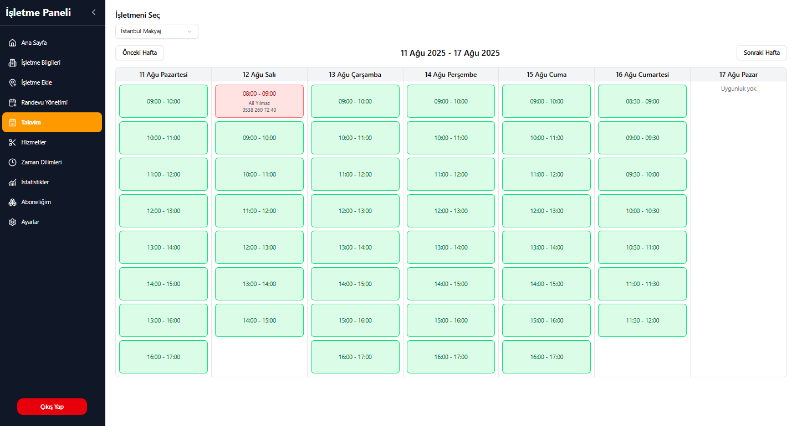

## Müşteri Randevu Ekranı İşletme Bilgisi Kısmı

Müşterilerin belirli bir işletme için randevu alabileceği ana sayfa. İşletme bilgilerini, müsait zaman dilimlerini ve hizmetleri görüntüleyerek randevu formunu doldurabilirler ve telefon doğrulaması ile hızlıca kolay bir şekilde randevularını oluşturabilirler.


## Müşteri Randevu Ekranı Randevu Alma Kısmı

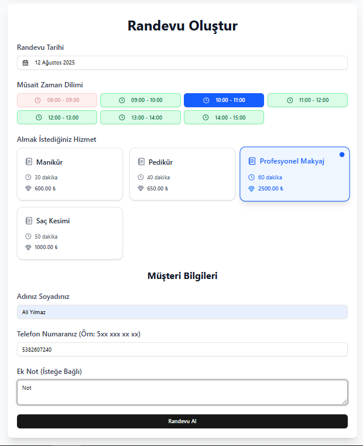

## Müşteri SMS Kodu İle Randevuyu Onaylama

Müşterilerin "Randevu Al" butonuna tıkladıklarında telefon onaylama ekranı geliyor. Burada hem son kez randevu bilgilerini kontrol edebiliyolar hem de SMS ile gelen kodu girerek randevularını alabiliyorlar.
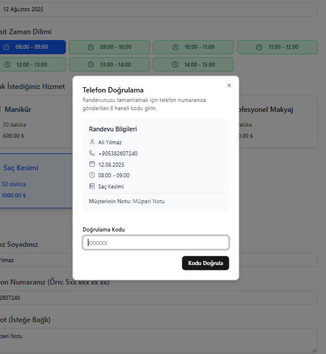
