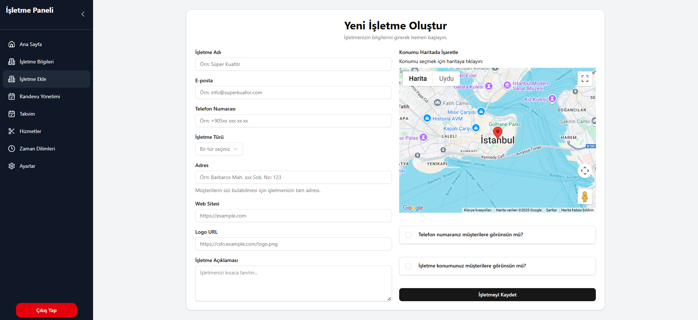
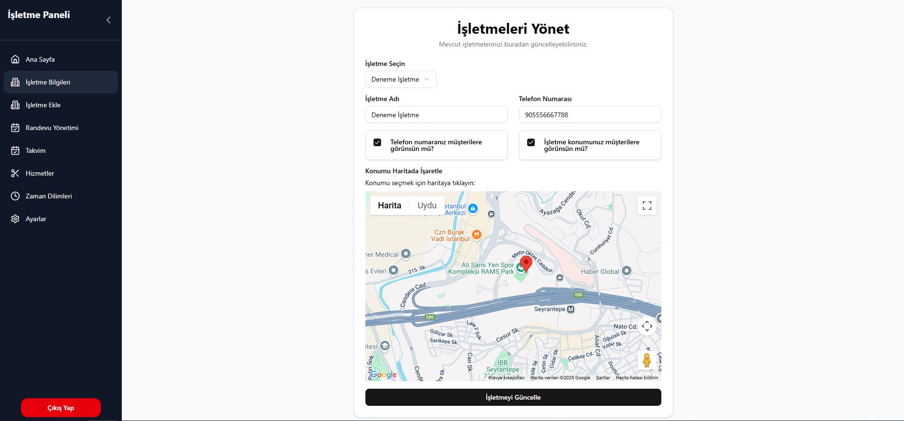
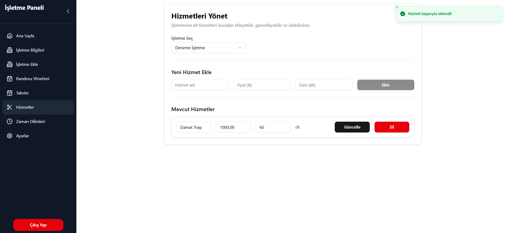
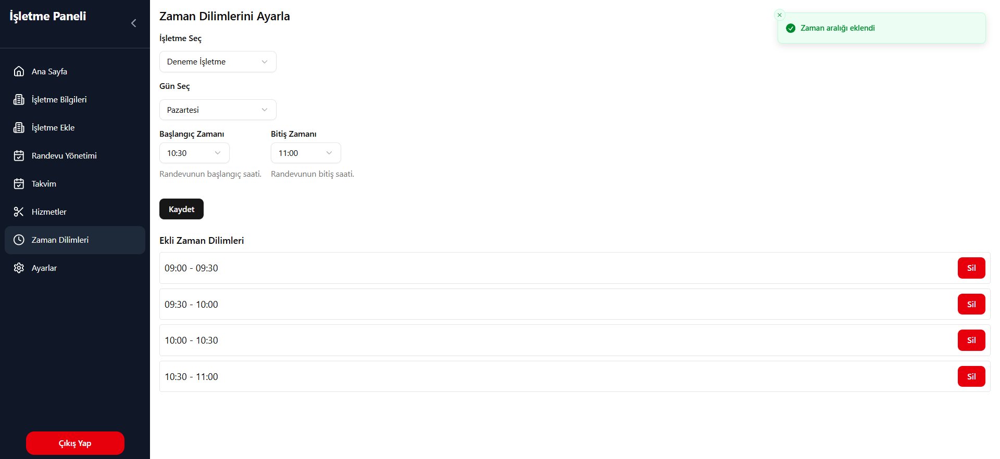
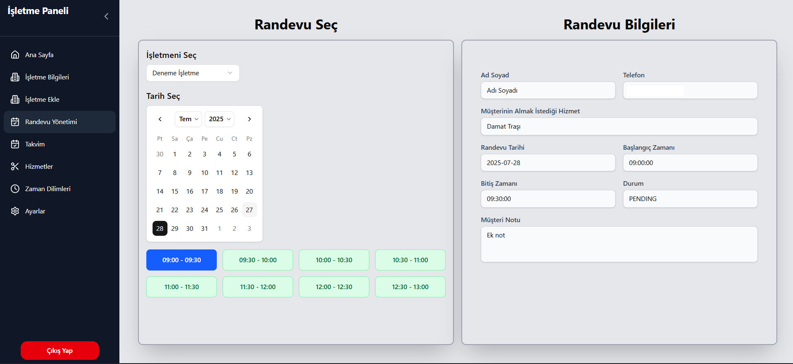
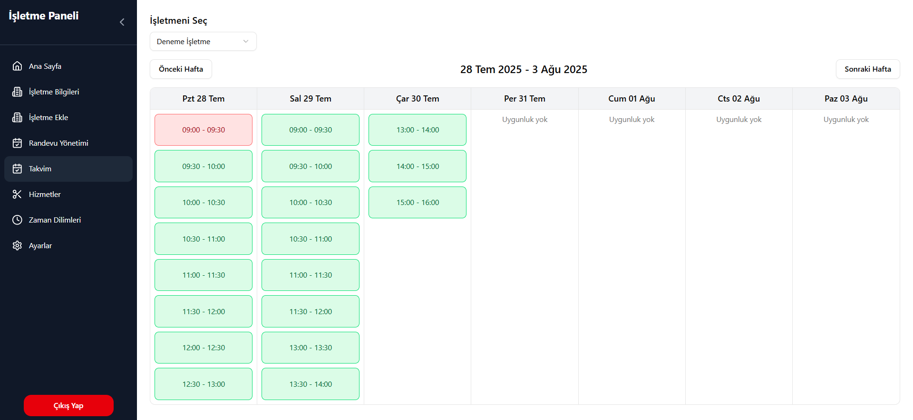
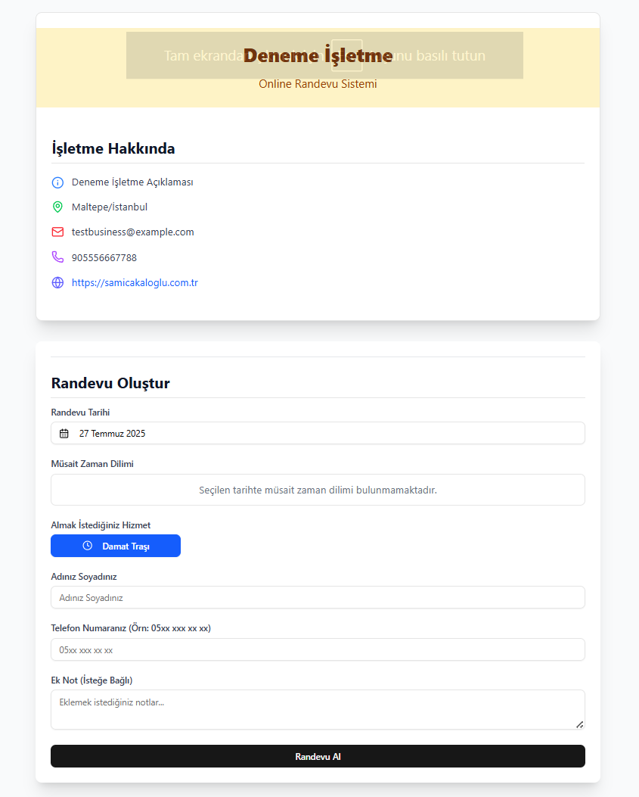

# Appointment System Frontend

Bu proje, kullanıcıların randevu oluşturmasını, işletmelerin randevuları yönetmesini ve yöneticilerin tüm sistemi kontrol etmesini sağlayan bir **Randevu Yönetim Sistemi**'nin frontend tarafıdır.

Uygulama, müşterilerin işletmeleri keşfetmesini, müsait zaman dilimlerini görüntülemesini ve sorunsuz bir şekilde randevu almasını sağlar. İşletme sahipleri için randevu, hizmet ve zaman yönetimi araçları sunarken, yöneticilere sistem genelinde kapsamlı bir kontrol imkanı tanır. Şık, duyarlı ve sezgisel bir kullanıcı deneyimi sunmak üzere tasarlanmıştır.

---

## 🚀 Kullanılan Teknolojiler

| Teknoloji                                                                                            | Açıklama                                                                                                                                                             |
| ---------------------------------------------------------------------------------------------------- | -------------------------------------------------------------------------------------------------------------------------------------------------------------------- |
| **[Next.js](https://nextjs.org/)**                                                                   | React tabanlı, sunucu tarafı renderlama (SSR), statik site üretimi (SSG) ve API rotaları gibi özelliklerle performans ve SEO'yu artıran güçlü bir React framework'ü. |
| **[Tailwind CSS](https://tailwindcss.com/)**                                                         | Hızlı ve esnek UI geliştirmeyi sağlayan, utility-first bir CSS framework.                                                                                            |
| **[ShadCN UI](https://ui.shadcn.com/)**                                                              | Tailwind CSS ve Radix UI üzerine inşa edilmiş, erişilebilir ve özelleştirilebilir, modern UI bileşenleri kütüphanesi.                                                |
| **[Redux Toolkit](https://redux-toolkit.js.org/)**                                                   | Durum yönetimi için standart bir çözüm sunar. Özellikle RTK Query ile API istekleri, önbellekleme, yükleme ve hata durumları kolayca yönetilir.                      |
| **[Zod](https://zod.dev/)**                                                                          | Form doğrulama ve veri şemalarını tanımlamak için kullanılan TypeScript-first şema bildirim ve doğrulama kütüphanesi.                                                |
| **[Google Maps JS API](https://developers.google.com/maps/documentation/javascript/overview?hl=tr)** | Konum seçimi ve harita tabanlı işlemler için                                                                                                                         |
| **[Lucide React](https://lucide.dev/)**                                                              | Uygulama genelinde kullanılan hafif ve özelleştirilebilir ikonlar kütüphanesi.                                                                                       |
| **[Sonner](https://www.npmjs.com/package/sonner)**                                                   | Kullanıcıya şık ve özelleştirilebilir toast bildirimleri sunmak için kullanılan bir kütüphane.                                                                       |

---

# Kullanıcı Rolleri

- **Customer** – Randevu oluşturur
- **Business** – Randevuları, işletmesini ve takvimini yönetir
- **Admin** – Paketleri ve işletmeleri yönetir

# Dosya Yapsısı

Bu proje, Next.js App Router'ın modern dosya tabanlı yönlendirme ve düzenleme yapısını kullanır.

```bash
src/
├── app/                          # Ana uygulama dizini (App Router)
│   ├── page.tsx                    # Ana sayfa
│   ├── layout.tsx                  # Genel uygulama düzeni (Root Layout)
│   ├── globals.css                 # Genel CSS stilleri
│   │
│   ├── (auth)/                     # Kimlik doğrulama ile ilgili rotalar grubu
│   │   ├── login/page.tsx          # Giriş sayfası
│   │   ├── register/page.tsx       # Kayıt sayfası
│   │   ├── confirmEmail/page.tsx   # E-posta doğrulama sayfası
│   │   ├── forgotPassword/page.tsx # Şifre sıfırlama sayfası
│   │   └── layout.tsx              # Kimlik doğrulama rotalarına özel düzen
│   │
│   ├── (routes)/                   # Genel, herkese açık rotalar grubu
│   │   ├── about/page.tsx          # Hakkımızda sayfası
│   │   ├── business/page.tsx       # İşletme listeleme sayfası
│   │   ├── contact/page.tsx        # İletişim sayfası
│   │   ├── packages/page.tsx       # Abonelik paketleri sayfası
│   │   └── layout.tsx              # Genel rotalara özel düzen
│   │
│   ├── [slug]/                     # Dinamik işletme randevu sayfası (örn: /bir-isletme-adi)
│   │   └── page.tsx                # İşletmeye özel randevu alma sayfası
│   │
│   └── dashboard/                  # Kimlik doğrulaması gerektiren paneller
│       ├── layout.tsx              # Dashboard genel düzeni
│       │
│       ├── admin/                  # Yönetici (Admin) paneli rotaları
│       │   ├── page.tsx            # Admin ana sayfası
│       │   ├── business/page.tsx   # Admin: İşletme yönetimi
│       │   ├── packages/page.tsx   # Admin: Paket yönetimi
│       │   └── layout.tsx          # Admin paneline özel düzen
│       │
│       └── business/               # İşletme Sahibi paneli rotaları
│           ├── page.tsx                # İşletme ana sayfası
│           ├── appointments/page.tsx   # İşletme: Randevu görüntüleme/yönetimi
│           ├── calendar/page.tsx       # İşletme: Haftalık takvimden randevu görüntüleme
│           ├── createBusiness/page.tsx # İşletme: İşletme oluşturma
│           ├── profile/page.tsx        # İşletme: İşletme bilgilerini görüntüleme/güncelleme
│           ├── services/page.tsx       # İşletme: İşletmenin vereceği hizmetleri yönetme
│           ├── settings/page.tsx       # İşletme: Ayarlar sayfası
│           ├── statistics/page.tsx     # İşletme: İşletmenin istatistikleri
│           ├── time-slots/page.tsx     # İşletme: İşletmenin zaman aralıklarını yönetme
│           └── layout.tsx              # İşletme paneline özel düzen
│
├── components/                 # Yeniden kullanılabilir UI bileşenleri
│   ├── appointment/            # Randevu akışına özel bileşenler
│   ├── auth/                   # Kimlik doğrulama formları/UI
│   ├── contact/                # İletişim formları/UI
│   ├── dashboard/              # Dashboard genel bileşenleri
│   │   └── business/           # İşletme dashboard'ına özel bileşenler
│   │   └── admin/              # Admin dashboard'ına özel bileşenler
│   ├── footer/                 # Footer
│   ├── header/                 # Mobil & desktop header
│   ├── ui/                     # ShadCN UI bileşenleri
│   └── home/                   # Landing page bileşenleri (Hero, Features, Pricing...)
│
├── lib/                        # Yardımcı fonksiyonlar ve yapılandırmalar
│   ├── slices/                 # Redux dilimleri (slices)
│   ├── auth.ts                 # Kimlik doğrulama yardımcıları
│   ├── ReduxProvider.tsx       # Redux store'u sağlayan bileşen
│   ├── store.ts                # Redux store yapılandırması
│   ├── utils.ts                # Çeşitli yardımcı fonksiyonlar (örn: `cn` için)
│   ├── zodSchemas.ts           # Zod ile tanımlanmış şemalar
│   └── api-requests.ts         # Doğrudan fetch yapan API fonksiyonları (Server Components için)
│
├── models/                     # TypeScript arayüzleri ve veri modelleri
├── services/                   # Redux Toolkit Query API servisleri (RTK Query)
├── hooks/                      # Özel React hook'ları

├── next.config.js              # Next.js yapılandırması
├── middleware.ts               # Role-based yönlendirmeler için middleware
```

## 🖼️ Ekran Görüntüleri

## Ana Sayfa Ekranı


## Paketler Ekranı


## Kayıt Ekranı


## Giriş Ekranı

Kullanıcı e-mail ve şifresi ile giriş yapabilir.


## E-mail Doğrulama


## İşletme Paket Seçme Ekranı


## İşletme Ekleme Ekranı



## İşletme Detay Ekranı



## İşletme Hizmet Yönetimi Ekranı



## İşletme Zaman Aralıkları Yönetimi Ekranı



## İşletme Randevu Yönetimi Ekranı



## İşletme Takvim Ekranı



## Müşteri Randevu Ekranı


